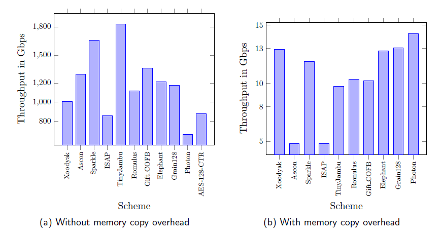

# NIST-LWC-finalists-GPU

GPU Implementation of Authenticated Encryption with Associate Data (AEAD) Finalists Candidates in NIST Lightweight Cryptography Standardization. 
Each AEAD consist of 3 different folders:

1. Parallel Granularity folder consist techniques for coarse-grain, fine-grain (only in Photon, Grain128, Elephant, Gift-COFB and Xoodyak), memory structure optimization, and other specific techniques.
2. Coalesced folder consist of coalesced memory access technique.
3. Concurrent folder consist of concurent kernel technique.

This is the code from the paper "High throughput acceleration of NIST lightweight authenticated encryption schemes on GPU platform", available at (https://link.springer.com/article/10.1007/s10586-024-04463-x)

## Abstract
Authenticated encryption with associated data (AEAD) has become prominent over time because it offers authenticity and confidentiality simultaneously. In 2018, the National Institute of Standards and Technology (NIST) initiated a competition to standardize lightweight AEAD and hash functions, with Ascon as the final winner among the 10 finalists. Numerous prior works evaluated their performance on FPGA and ASIC, but not on a parallel architecture like GPU, which is a common accelerator already found in many existing cloud servers. In this work, the first GPU implementation of the NIST AEAD finalists is proposed. Several GPU implementation techniques applicable to all AEAD schemes are presented, along with novel techniques for some specific schemes to enhance throughput performance. Experimental results show that all NIST AEAD finalists can achieve high throughput (up to 111.53M AEAD per second), approximately `142.19%` and `72.65%` improvement compared to unoptimized GPU version, and the investigated FPGA results respectively.

#### High throughput AEAD in IoT applications

  

Due to Industry 4.0, SMEs are increasingly adopting IoT systems for efficient management, but the high cost of full IoT infrastructure poses a challenge. A cost-effective alternative is the pay-as-you-use IoT service model, akin to cloud computing. However, data privacy concerns arise, as sensitive IoT data could give competitors an edge if leaked. To address this, IoT solutions employing AEAD (Authenticated Encryption with Associated Data) can secure data, allowing SMEs to encrypt sensor data before transmission. Edge computing on IoT gateways, accelerated by GPUs, can handle decryption and real-time responses efficiently. Alternatively, encrypted data can be sent to cloud servers for analysis, with high-throughput AEAD decryption ensuring smooth operations. SMEs can also choose to store ciphertext on the cloud and analyze data locally, balancing cost and security. This system provides a secure, cost-effective solution for IoT integration in manufacturing. GPU acceleration aids in speeding up AEAD computation, essential for real-time response in IoT gateways and high-throughput decryption on cloud servers, as illustrated in Figure 1. `This research aimed to balance cost and security, making IoT adoption more feasible for SMEs.`

#### Throughput of proposed implementations for NIST AEAD finalists with and without memory copy overhead in Gbps on a Titan Xp GPU

  

